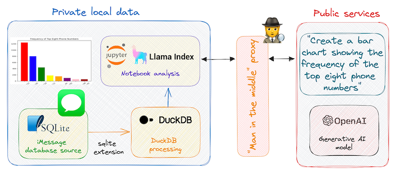
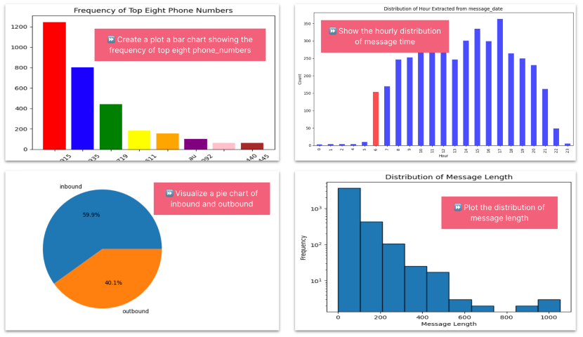

# Paranoid analysis of iMessage chats with OpenAI, LlamaIndex & DuckDB

Can I safely combine my local personal data with a public large language model to understand my texting behaviour? 



A project combining natural language and generative AI models to explore my private data without sharing (too much of) my personal life with the robots.

## Blog & notebook
You should also read the [blog](https://simon-aubury.medium.com/60e5eb9e23e3) and jump over to [notebook](./iMessage_Analysis.ipynb) for the detailed steps.

## Setup virtual python environment
Create a [virtual python](https://packaging.python.org/en/latest/guides/installing-using-pip-and-virtual-environments/) environment to keep dependencies separate. The _venv_ module is the preferred way to create and manage virtual environments.

 ```console
python3 -m venv .venv
```

Before you can start installing or using packages in your virtual environment you’ll need to activate it. 

```console
source .venv/bin/activate
pip install --upgrade pip
pip install -r requirements.txt
 ```
 


